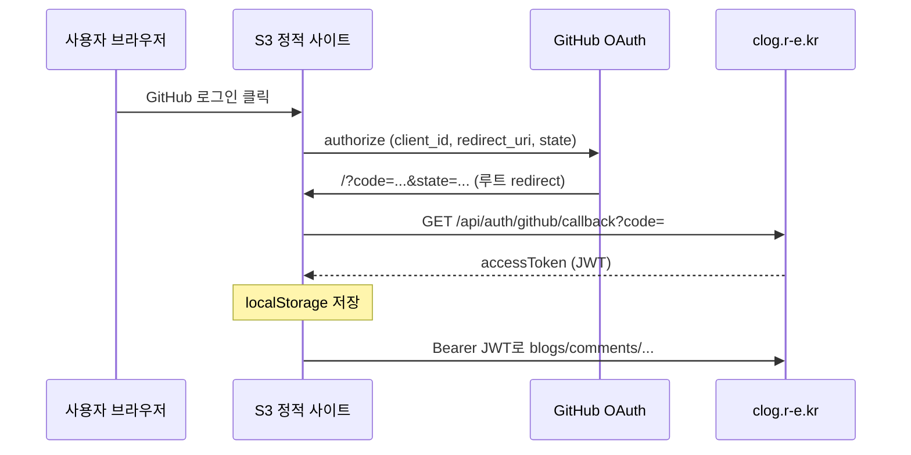

# CLOG 웹 블로그 (clog_web)

VS Code Extension과 연동되는 CLOG의 **브라우저용 웹 블로그 프론트엔드**입니다.  
공개 글 읽기, GitHub OAuth 로그인, 글 관리, 댓글, 북마크를 [CLOG API](https://clog.r-e.kr)와 연동합니다.

| 항목 | 값 |
|------|-----|
| 배포 URL (예) | `http://clog-frontend-project.s3-website.ap-northeast-2.amazonaws.com` |
| API Base (배포) | `https://clog.r-e.kr` |
| API Base (로컬 백엔드) | `http://localhost:8080` |
| 스택 | React 19 · Vite 6 · TypeScript · Tailwind CSS 4 · HashRouter |
| 정적 호스팅 | AWS S3 웹사이트 엔드포인트 |

상세 S3 설정·403/CORS 절차는 [DEPLOY.md](./DEPLOY.md)를 참고하세요.

---

## 목차

1. [기능 개요](#1-기능-개요)
2. [아키텍처](#2-아키텍처)
3. [시작하기](#3-시작하기)
4. [환경 변수](#4-환경-변수)
5. [GitHub 로그인 (OAuth)](#5-github-로그인-oauth)
6. [API 연동](#6-api-연동)
7. [프로젝트 구조](#7-프로젝트-구조)
8. [배포](#8-배포)
9. [트러블슈팅](#9-트러블슈팅)
10. [VS Code Extension과 구분](#10-vs-code-extension과-구분)
11. [체크리스트](#11-체크리스트)

---

## 1. 기능 개요

| 영역 | 비로그인 | 로그인 (CLOG JWT) |
|------|----------|-------------------|
| 공개 피드·글 상세 | ✅ | ✅ |
| 조회수 증가 | ✅ (공개 발행 글) | ✅ |
| 댓글 | 게스트 닉네임 또는 회원 | 회원 |
| 북마크 | ❌ | ✅ |
| 내 글 관리·작성·발행 | ❌ | ✅ (`/admin`) |

---

## 2. 아키텍처



- **라우팅:** `HashRouter` — S3 정적 호스팅에서 별도 서버 없이 SPA 동작 (`/#/blog`, `/#/admin` 등).
- **OAuth 콜백:** GitHub `redirect_uri`는 **사이트 루트** (`http://...amazonaws.com/`, `#` 없음).  
  `?code=`는 `window.location.search`에 붙으며, `OAuthQueryHandler`가 처리 후 `/#/`로 정리합니다.
- **인증 저장:** `localStorage` — 키 `clog_access_token`, `clog_user` (브라우저·기기별로 분리).

---

## 3. 시작하기

### 요구 사항

- Node.js 18+
- pnpm 10+

### 설치·로컬 실행 (권장: Vite)

```bash
pnpm install
cp .env.example .env.local
# .env.local 편집 (아래 환경 변수 참고)
pnpm dev          # http://localhost:5173
```

### 빌드·미리보기

```bash
pnpm build        # dist/
pnpm preview      # dist 로컬 서빙
```

### Next.js (레거시, 선택)

`app/` 디렉터리는 Next App Router 잔존 코드입니다. **S3 배포·일상 개발은 Vite(`pnpm dev`) 기준**입니다.

```bash
pnpm dev:next
pnpm build:next
```

---

## 4. 환경 변수

`.env.local`은 **git에 올리지 않습니다.** Vite는 `pnpm build` 시 `VITE_*` 값을 **번들에 포함**합니다.

### 프로덕션(S3) 빌드 — 필수

| 변수 | 설명 |
|------|------|
| `VITE_API_BASE_URL` | API 서버 (예: `https://clog.r-e.kr`) |
| `VITE_GITHUB_CLIENT_ID` | GitHub OAuth App **Client ID** (공개) |
| `VITE_OAUTH_REDIRECT_URI` | OAuth App **Authorization callback URL**과 **완전 동일** (끝 `/` 없음) |

예 (S3):

```env
VITE_API_BASE_URL=https://clog.r-e.kr
VITE_GITHUB_CLIENT_ID=Ov23li...
VITE_OAUTH_REDIRECT_URI=http://clog-frontend-project.s3-website.ap-northeast-2.amazonaws.com
```

### 로컬 개발 전용

| 변수 | 설명 |
|------|------|
| `VITE_DEV_CLOG_TOKEN` | `pnpm dev` 시에만 자동 로그인 (eyJ… JWT) |

> **⚠️ 프로덕션 빌드에 `VITE_DEV_CLOG_TOKEN`을 넣으면 안 됩니다.**  
> 번들에 JWT가 박혀 **모든 방문자가 동일 계정**으로 로그인되는 사고가 발생했습니다.  
> 현재 코드는 `import.meta.env.DEV`일 때만 dev 토큰을 적용합니다 (`lib/dev-auth.ts`).

### Next.js 로컬

`NEXT_PUBLIC_*` 접두사로 동일 항목 설정 (`.env.example` 참고).

---

## 5. GitHub 로그인 (OAuth)

웹 블로그는 **GitHub OAuth `code` 방식**만 사용합니다.  
`POST /api/auth/github/token` (`gho_` 토큰)은 **VS Code Extension 전용**이며 웹에서 사용하지 않습니다.

### 흐름

1. 사용자 **「GitHub 로그인」** 클릭 → `lib/github-oauth.ts` → GitHub authorize URL 이동  
2. GitHub 승인 → `redirect_uri`로 리다이렉트  
   `http://...amazonaws.com/?code=xxx&state=yyy`  
3. `OAuthQueryHandler` / `lib/oauth-callback-handler.ts`  
   - `state` CSRF 검증 (`sessionStorage`)  
   - `GET {API}/api/auth/github/callback?code=`  
4. 응답 `data.accessToken` → `localStorage` 저장  
5. 이후 모든 API: `Authorization: Bearer {JWT}`  
6. URL에서 `code` 제거 (`history.replaceState`)

### Authorize URL 파라미터

```
https://github.com/login/oauth/authorize
  ?client_id={VITE_GITHUB_CLIENT_ID}
  &redirect_uri={VITE_OAUTH_REDIRECT_URI}   # URL 인코딩됨
  &scope=read:user user:email
  &state={랜덤 UUID}
```

### JWT (참고)

| Claim | 의미 |
|-------|------|
| `sub` | 회원 ID (`users.id`) |
| `nickname` | 닉네임 |
| `email` | 이메일 |
| `exp` | 만료 (기본 약 1시간, 리프레시 없음 → 재로그인) |

### 백엔드·GitHub App 정합

프론트 `redirect_uri`와 **백엔드 code 교환 시 사용하는 redirect_uri**가 같아야 합니다.  
Client **Secret**은 백엔드만 보관합니다 (프론트·S3·git 금지).

---

## 6. API 연동

공통 응답 형식:

```json
{ "success": true, "data": { ... }, "error": null }
```

클라이언트: `lib/api/client.ts` — `apiRequest()`, `ApiError`.

### 웹 블로그에서 사용하는 API

| Method | Path | 용도 | 인증 |
|--------|------|------|------|
| GET | `/api/auth/github/callback?code=` | code → JWT | 없음 |
| GET | `/api/blogs/published` | 공개 피드 | 없음 |
| GET | `/api/blogs/{blogId}` | 글 상세 | 없음 (선택 Bearer) |
| POST | `/api/blogs/{blogId}/view` | 조회수 | 없음 |
| GET | `/api/blogs/users/{userId}` | 작성자 글 목록 | Bearer |
| POST | `/api/blogs` | 글 작성 | Bearer |
| PUT | `/api/blogs/{blogId}` | 글 수정 | Bearer |
| POST | `/api/blogs/{blogId}/publish` | 발행 | Bearer |
| DELETE | `/api/blogs/{blogId}` | 삭제 | Bearer |
| GET | `/api/comments/blog/{blogId}` | 댓글 목록 | 없음 |
| POST | `/api/comments` | 댓글 작성 | 없음 / Bearer |
| PUT | `/api/comments/{commentId}` | 댓글 수정 | Bearer |
| DELETE | `/api/comments/{commentId}` | 댓글 삭제 | Bearer |
| GET | `/api/bookmarks` | 북마크 목록 | Bearer |
| POST | `/api/bookmarks` | 북마크 추가 | Bearer |
| DELETE | `/api/bookmarks/{bookmarkId}` | 북마크 해제 | Bearer |
| GET | `/api/users/{userId}` | 프로필 | Bearer |

모듈: `lib/api/blogs.ts`, `comments.ts`, `bookmarks.ts`, `users.ts`, `auth.ts`.

---

## 7. 프로젝트 구조

```
clog_web/
├── index.html              # Vite 엔트리
├── src/
│   ├── main.tsx            # HashRouter
│   ├── App.tsx             # 라우트 정의
│   ├── OAuthQueryHandler.tsx
│   ├── Layout.tsx
│   └── pages/              # 홈, 블로그, 상세, 관리, 북마크, 소개
├── components/             # UI, navigation, oauth-handler, …
├── lib/
│   ├── api/                # API 클라이언트·타입
│   ├── auth-context.tsx    # 인증 Provider
│   ├── auth-token.ts       # JWT·localStorage
│   ├── github-oauth.ts     # authorize URL·state
│   ├── oauth-callback-handler.ts
│   └── dev-auth.ts         # 로컬 전용 자동 로그인
├── app/                    # Next.js 레거시 (선택)
├── scripts/deploy-s3.sh
├── DEPLOY.md               # S3·CORS 상세
├── .env.example
└── dist/                   # pnpm build 산출물 → S3 업로드
```

### 주요 라우트 (Hash)

| 경로 | 페이지 |
|------|--------|
| `/#/` | 홈 |
| `/#/blog` | 블로그 목록 |
| `/#/blog/:blogId` | 글 상세 |
| `/#/admin` | 내 글 관리 (로그인 필요) |
| `/#/bookmarks` | 북마크 (로그인 필요) |
| `/#/about` | 소개 |
| `/#/auth/login` | (자동) GitHub OAuth로 리다이렉트 |
| `/#/auth/callback` | OAuth 보조 처리 |

---

## 8. 배포

```bash
# 1. 프로덕션 env로 빌드 (DEV 토큰 없이)
pnpm build

# 2. S3 업로드
./scripts/deploy-s3.sh YOUR_BUCKET_NAME [CLOUDFRONT_DISTRIBUTION_ID]
```

- `.env` 파일은 S3에 **업로드하지 않음** (빌드 시점에만 사용).
- env 변경 후 **반드시 재빌드·재업로드**.
- S3 **웹사이트 엔드포인트** URL로 접속 (`http://버킷.s3-website-...`).

자세한 버킷 정책·오류 문서·CORS: [DEPLOY.md](./DEPLOY.md).

### CORS (백엔드)

`APP_CORS_ALLOWED_ORIGINS`에 프론트 origin 추가 (끝 `/` 없음):

```text
http://clog-frontend-project.s3-website.ap-northeast-2.amazonaws.com
```

---

## 9. 트러블슈팅

| 증상 | 원인 | 조치 |
|------|------|------|
| `crypto.randomUUID is not a function` | S3가 **HTTP** → secure context 아님 | `lib/github-oauth.ts`에서 `getRandomValues` 폴백 적용됨. 최신 `dist` 배포 |
| `OAuth state 검증에 실패` | state 소실·중복 호출·새 탭 | **GitHub 로그인** 다시. 최신 번들(중복 호출 방지) 배포 |
| `GET .../callback?code= 500` | 백엔드 code 교환 실패 | redirect_uri·Client Secret·백엔드 로그 확인. **code 1회용** → 재로그인 |
| CORS 에러 | origin 미등록 | 백엔드 `APP_CORS_ALLOWED_ORIGINS`에 S3 URL 추가 |
| S3 403 | REST 엔드포인트 접속 | **웹사이트 엔드포인트** URL 사용 |
| 모두 같은 계정으로 보임 | `VITE_DEV_CLOG_TOKEN`이 **프로덕션 빌드**에 포함 | env에서 제거 후 재빌드. 방문자 **로그아웃** |
| GitHub 로그인 버튼 무반응 | `VITE_GITHUB_CLIENT_ID` 미설정 | `.env.local` 후 **재빌드** |
| 토큰 붙여넣기 로그인 화면 | 구버전 `dist` | 최신 빌드 배포. 로그인은 **GitHub OAuth만** |

### nginx 로그 예시

```text
GET /api/auth/github/callback?code=... HTTP/2.0" 500
Referer: http://clog-frontend-project.s3-website.../
```

→ 프론트는 code를 정상 전달. **백엔드·GitHub App 설정** 점검.

---

## 10. VS Code Extension과 구분

| | 웹 블로그 (S3) | VS Code Extension |
|--|----------------|-------------------|
| 로그인 API | `GET /api/auth/github/callback?code=` | `POST /api/auth/github/token` |
| 입력 | GitHub OAuth `code` | `gho_` GitHub access token |
| Bearer | CLOG JWT (`eyJ…`) | CLOG JWT (`eyJ…`) |
| `gho_`를 API Bearer에 사용 | ❌ | ❌ (교환 후 JWT만) |

---

## 11. 체크리스트

### 프론트 배포 전

- [ ] `VITE_GITHUB_CLIENT_ID` 설정 (백엔드 OAuth App과 동일 App)
- [ ] `VITE_OAUTH_REDIRECT_URI` = GitHub App callback URL (끝 `/` 없음)
- [ ] **`VITE_DEV_CLOG_TOKEN` 프로덕션 env에 없음**
- [ ] `pnpm build` 후 `dist/` S3 업로드
- [ ] S3 웹사이트 호스팅 + 오류 문서 `index.html` (권장)

### 백엔드·인프라

- [ ] `APP_CORS_ALLOWED_ORIGINS`에 S3 origin
- [ ] code 교환 시 `redirect_uri` = 프론트와 동일
- [ ] GitHub Client Secret은 서버만

### 로그인 검증

- [ ] A PC GitHub 계정 A → A 프로필·내 글
- [ ] B PC GitHub 계정 B → B 프로필 (서로 다름)
- [ ] 로그아웃 후 비로그인 상태에서 북마크·관리 불가

---

## 관련 문서

- [DEPLOY.md](./DEPLOY.md) — S3·403·CORS·CloudFront
- 백엔드 레포 `docs/API_SPEC.md` — API 상세
- 백엔드 레포 `docs/FRONTEND_OAUTH_HANDOFF.md` — OAuth 핸드오프

---

## 스크립트 요약

| 명령 | 설명 |
|------|------|
| `pnpm dev` | Vite 개발 서버 |
| `pnpm build` | 프로덕션 빌드 → `dist/` |
| `pnpm preview` | `dist` 로컬 미리보기 |
| `pnpm dev:next` | Next 개발 (레거시) |
| `./scripts/deploy-s3.sh` | S3 sync |

---

*문서 기준: 2026-05-25 — CLOG 웹 블로그 API·OAuth 연동·S3 배포 통합.*
